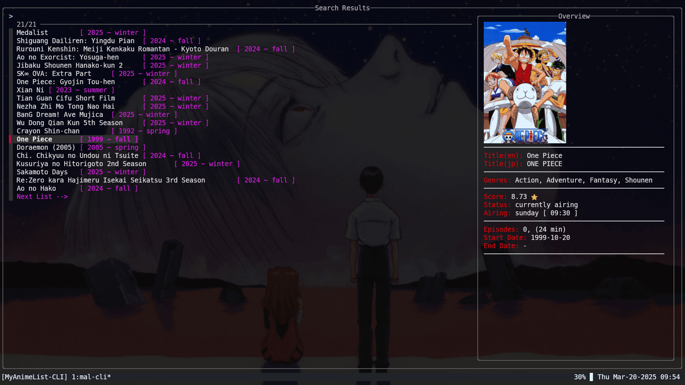
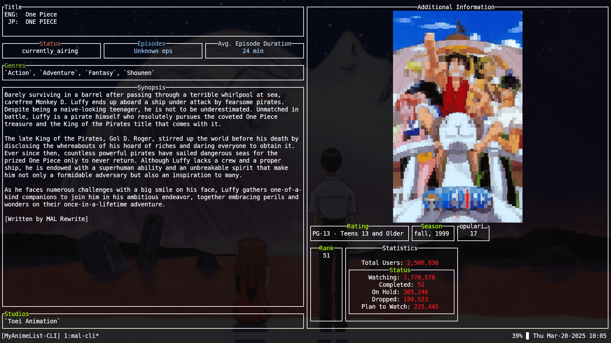
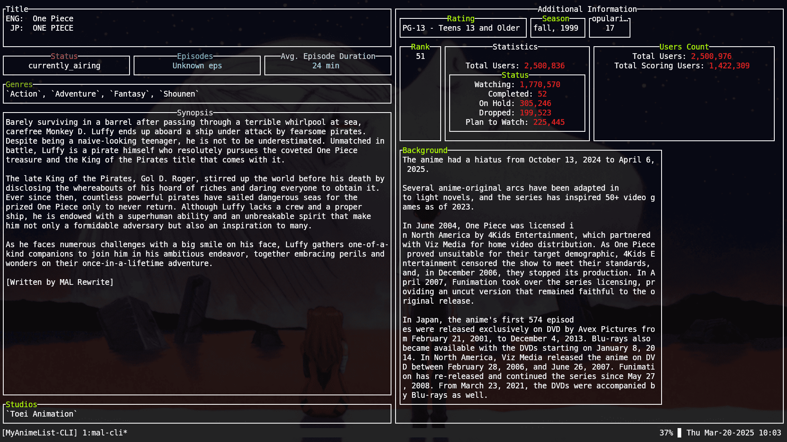
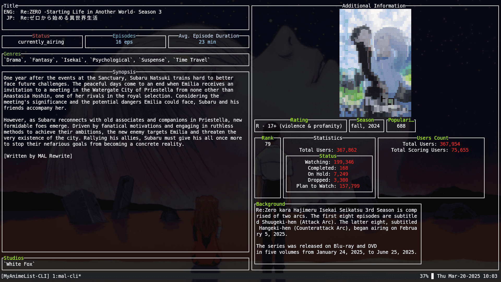
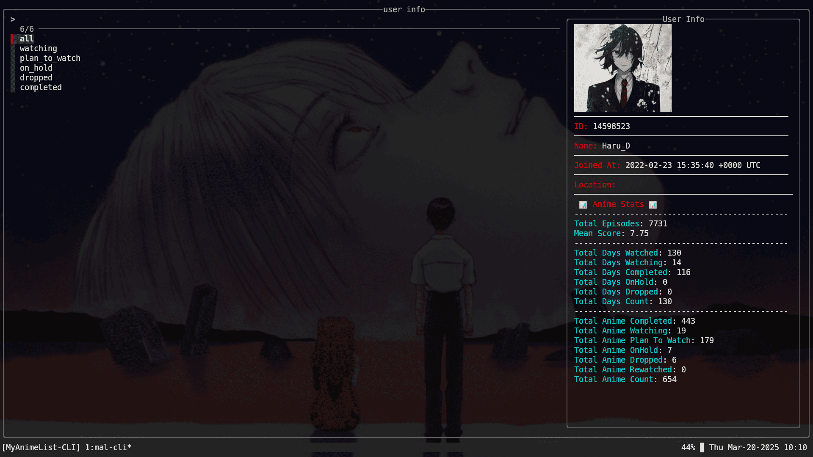
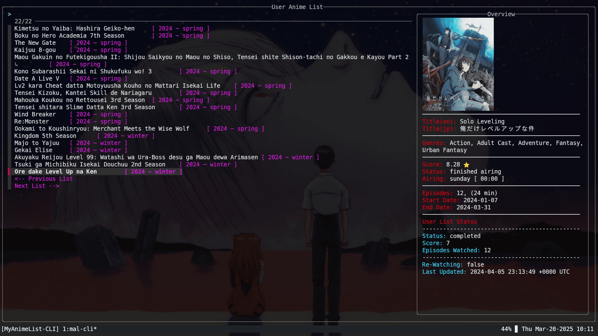

# MyAnimeList-CLI

search anime stuff from terminal

> **Note**
> This project is under development.
> I try to work on this project whenever I get free time from my university studies and other commitments.
> To stay up to date with all the changes, you can switch to the `dev` branch.

---

#### Steps to install (linux):

1. Clone the repository:

    `git clone https://github.com/HarudaySharma/MyAnimeList-CLI.git --depth=1`

2. Navigate to the project folder and run the installer:

    `cd MyAnimeList-CLI && ./install.sh`

3. Verify the installation by checking the help menu:

    `mal-cli --help`

4. Explore the available commands:
    - Run `mal-cli [command] --help` to see how each command works.
    - Try different commands and see what the tool offers!

**Recommended**: Use Kitty as your terminal emulator for the best experience.
Since mal-cli was developed using Kitty, it provides better image rendering.

---

#### Navigation Key-Bindings:

1. `Ctrl-C` → Navigate back from a window pane.
1. `f` (on anime details page) → Toggle a form to add/update anime in your list. (**NOTE:** you must be logged in to do this operation. use `mal-cli me login` to access your mal account in the tool.)

---

#### TroubleShooting:

If the tool stops working unexpectedly, try stopping the daemon with: `mal-cli stop_daemon`

---

#### Here are some images

---

#### TODO
- [ ] make the project alpha testing ready.
- [ ] fix user anime list `episodesWatched` updation
